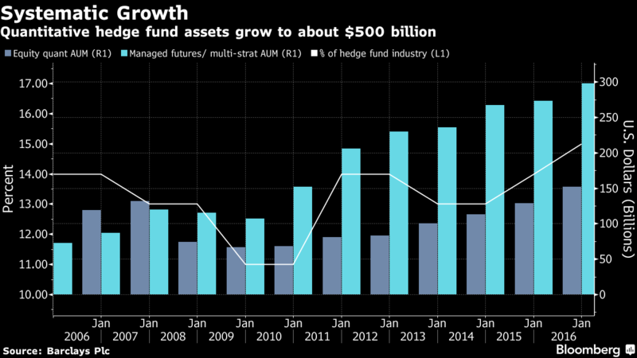
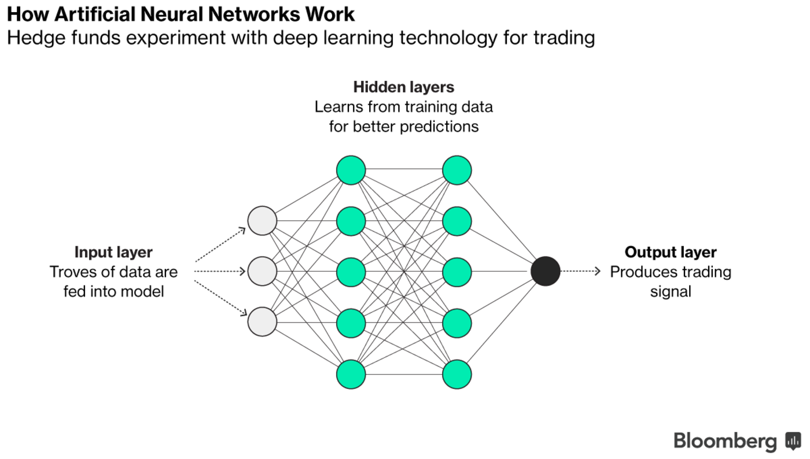
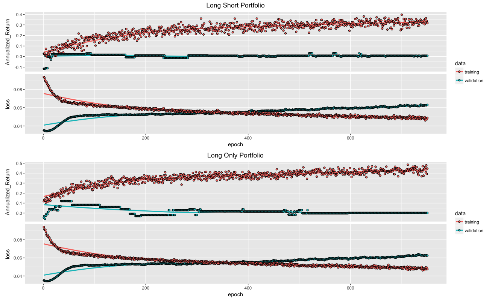
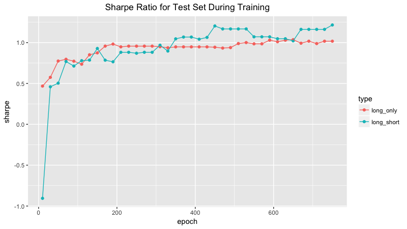

```{r setup, include=FALSE}
knitr::opts_chunk$set(echo = TRUE)
```

```{r, message = FALSE, echo = FALSE, eval = TRUE}
devtools::load_all()
```

## Rise of Quant Investing

If you've read anything about investing in the past few years, chances are you know about the rise of quantitative hedge funds. Assets run by quant funds have more than doubled in the past decade, rising to a record of $500 billion earlier this year. In some ways, quant's meteoric rise is due to the same technological advances disrupting many other industries. Faster computers, and more and better data has enabled asset managers to automate skills that were once limited to humans. 

```{r, echo = FALSE, eval = TRUE, out.width = "600px", fig.align='center'}

```

While the quant investing space is diverse and funds use a variety of methods, one new strategy has been getting a lot of attention: **Deep Learning**. Deep learning is an artificial intelligence technology that loosely mimics the neurons in our brains. Deep learning methodology can be utilized by what the industry calls a **neural network ((NN))**. The technology, which works best with large data sets, already powers Tesla's self-driving cars and Apple's Siri voice system. 

## What is a Nueral Network, and how do they Help Investors? 

Well what the heck is a neural network? Continuing with the brain analogy, a neural network is a acomputational graph of connected neurons. The neurons exchange signals and connections with one another through math equations, becoming more and more powerful as the system learns. Consider the picture below for a visual representation of how neural network models work. 

```{r, echo = FALSE, eval = TRUE, out.width = "600px", fig.align='center'}

```

So how can this technology help an investor? Consider an analyst searching for factors that differentiate good stocks and bad stocks. Without deep learning, the analyst must manually select indicators like the price to earnings ratio. With deep learning, the analyst doesn't have to define the factors in advance, and can feed a NN model with raw company and price data. The artificial neurons crunch the numbers and adjust their values in order to learn and get closer to the end goal: find factors that differentiate good and bad stocks.

## Can a Nueral Network help me Make Money?

Deep learning technology might be working for hedge funds, but can it also work for ordinary investors like you or I? In order to find out, I've gathered publicly available stock data from [Kaggle](https://www.kaggle.com) and created my own neural network model. Like the example above, I give my model information about each stock (PE ratio, accounts receivable, etc.) and the price one year in the future, and the network crunches the numbers and --hopefully-- learns to pick good stocks over bad stocks. In total, I provided the model with 76 potential indicators. 

Our overall goal is to produce a stock portfolio with a high **Sharpe ratio**. **Sharpe ratio** characterizes how well the return of an asset compensates the investor for the risk taken, and is the gold standard metric for evaluating portfolios. For reference, a Sharpe ratio of 1 is considered very good. 

Before I reveal the results, I'll explain how my network creates stock portfolios. The first thing we do is split the data into **training**, **validation**, and **testing** sets. The **training set** is used to adjust the weights on the neural network. The **validation set** is data used to make sure the model is not over fitting, or memorizing the training set data. We want our model to generalize, not memorize. The **testing set** is where the action happens. We use the **testing set** to evaluate the predictive power of the neural network model. 

After the model is trained, we input the never before seen test data and come up with a set of predictions. If the test data is for Apple (AAPL) and General Electric (GE), the model will output price predictions for AAPL and GE stocks one year in the future. 

The next step is to construct a **portfolio**, or combination of stocks to employ our capital. While investors work with a variety of portfolio structures, I'll try the two most popular: long only and market neutral (long short). Long only portfolios indicate a net buying stance, and guess that the stocks will rise in price. Market neutral portfolios buy equities that are expected to increase in value and sell short equities that are expected to decrease in value. While both strategies have their merits, many hedge funds use the market neutral approach since it is unexposed to trends of the broader group of stocks. Market neutral portfolios tend to have lower risk and usually perform better during economic and financial crises.

In both cases, I'll invest in the top 10% of my predictions. For long only, I'll invest equal weight in each stock in the top 10% of predictions. For long short, I'll invest half my money long in stocks in the top 5% of predictions, and sell short half my money in stocks in the bottom 5% of predictions.  

## Model

Below is a graph that shows important metrics during training for two models: one for a market neutral portfolio and another for a long only portfolio.

```{r, echo = FALSE, eval = TRUE, fig.align='center'}

```


## Choosing a final model 

Here's how it works: Given the full picture of our model throughout training, we select one epoch to calibrate the best or optimal model to use on the testing data. There are a variety of ways to do this, and we will take into account both metrics we collected during training, loss and yearly return. 

A quick rule of thumb is models that perform well in the validation set tend to be good models. 

Now remember, our overall goal is to construct a portfolio with a high **Sharpe ratio**. While neither loss nor yearly return are the same as Sharpe ratio, it makes sense that both are correlated with a good portfolio. Loss is the **mean squared error** between our price predictions and the actual prices. It makes sense that having a low mean squared error would be good for a stock portfolio. It also makes sense that a higher return is good for a stock portfolio. 

* **Long short portfolio:** As shown on the graph, minimum loss value occurs very early during training. Validation annualized return also optimizes very quickly. To counteract those points, I thought the model needed more epochs for training. We will select epoch 300 to construct our final model. 
* **Long only portfolio:** Similarly to above, the loss minimizes very quickly. This model features a better-shaped annualized return curve and there is a better defined maximum. Even so, I will select epoch 300 to construct the final model. 

## Portfolio results 

**Long short portfolio:** The final model featured an annualized return of 10.99% and an annualized standard deviation of returns of 11.31%, yielding a Sharpe ratio of 0.971. While most hedge funds don't report confidential metrics like Sharpe ratio, a 2014 study by the International Business & Economics Research Journal found that in the global hedge fund space, Sharpe ratios average about 0.38. While the two metrics are not direct comparisons, our long short portfolio compares favorably. 

Let's take a look at what stocks we invested in. Below are the top five short investments and the top five long investments for our portfolio. 

```{r, eval = TRUE, echo = FALSE, warning = FALSE, message = FALSE, results = "asis"}
library(knitr)
library(dplyr)
library(kableExtra)

data(short, package = "sandpr") 

to_show = short[c(1:5, 26:30), ]

## Make table 
to_show %>%
  kable("html") %>% kable_styling(bootstrap_options = "striped", full_width = F)
```
Our top short, General Motors, actually increased by 2.4% for the year. Overall, only one stock out of the five we sold short decreased in price during 2016. We performed much better on our long positions, where all five of our investments made money. This is not surprising, as 2016 was a bull market and the S&P 500 gained 11.96% as a whole.  

Overall, 0.971 is a good Sharpe ratio for a long short portfolio. We provide a near equal returns to risk ratio, and offer no net exposure to the market as a whole. 

**Long only portfolio:** The final model featured an annualized return of 23.45% and an annualized standard deviation of returns of 24.95%, yielding a Sharpe ratio of 0.940. This seems like a pretty high Sharpe at first glance, but it is lackluster compared to the 1.03 Sharpe ratio for the S&P 500 as a whole over the same period. 

```{r, eval = TRUE, echo = FALSE, warning = FALSE, message = FALSE, results = "asis"}
data(long, package = "sandpr")

to_show = long[1:10, ]

## Make table 
to_show %>%
  kable("html") %>% kable_styling(bootstrap_options = "striped", full_width = F)
```
As shown above, all of our top ten investments made money. This is not surprising considering the bull market, but still an achievement worth noting. Our biggest winner was mining company Freeport-McMoRan Inc. (FCX), which nearly doubled in price with a 94.8% gain in 2016. 

While our long only portfolio reports a quality Sharpe ratio of 0.940 for 2016, it fails to beat the S&P 500 benchmark over the same time period. Overall, we unfortunately would have been better off investing in the a S&P 500 ETF than using our fancy model.

## Did we choose the right model? 

In selecting the final model, we had 750 epochs to choose from. We used a combination of the loss and annualized return metrics, in addition to common sense and what can be best described as educated guessing. Consequently, it is unlikely that epoch 300 was the best performing model on the test set.

So, let's see how the model performs on the test set throughout training. Below is a picture that shows the Sharpe ratio for portfolios calibrated from different epochs during training.  

```{r, echo = FALSE, eval = TRUE, fig.align='center'}

```

This is a very interesting result. We see that test set Sharpe ratio for both portfolios increases - nearly monotonically - throughout training. Compare this to loss, which quickly reaches a minimum and then begins to rise before the first 50 epochs. Or annualized return, which quickly reaches a maximum and begins to taper off. 

We can conclude that neither mean squared error nor annualized return are accurate proxy measures for Sharpe ratio. It is consequently difficult to select the ideal model from our current training results. Our chosen epoch of 300 produced relatively good portfolios, but there was much more profit to be had if we waited for higher epochs. 

The above figure is concerning because it shows that model selection is at best imprecise. How can we choose the best model when the available metrics are not related to what we really care about? Unfortunately, I can offer no good answer to that question. Perhaps it is possible to construct a neural network model that uses **Sharpe ratio** as its loss function. Only then would be able to track the metric we truly care about. 

But that is a challenge for another day. 

## Conclusion 

Overall, our project was a success. We constructed two successful equities portfolios. Both portfolios gained more than 10% and provided a near 1 to 1 return to risk ratios. And more importantly, we showed that deep learning can be useful for retail investors like you or me. 

But regardless of the success of my little project, 2017 is only the beginning of quantitative investing. As more and better data becomes available, quant investing will continue to rise. Who knows, neural networks could mature from their infancy and become the gold standard for constructing investment portfolios. 
    